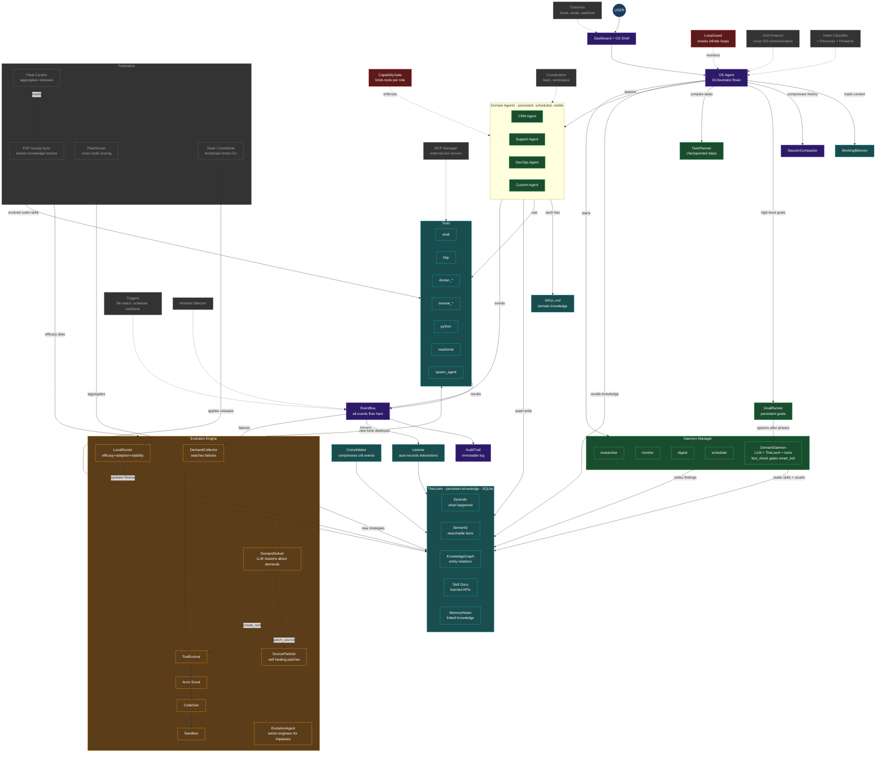
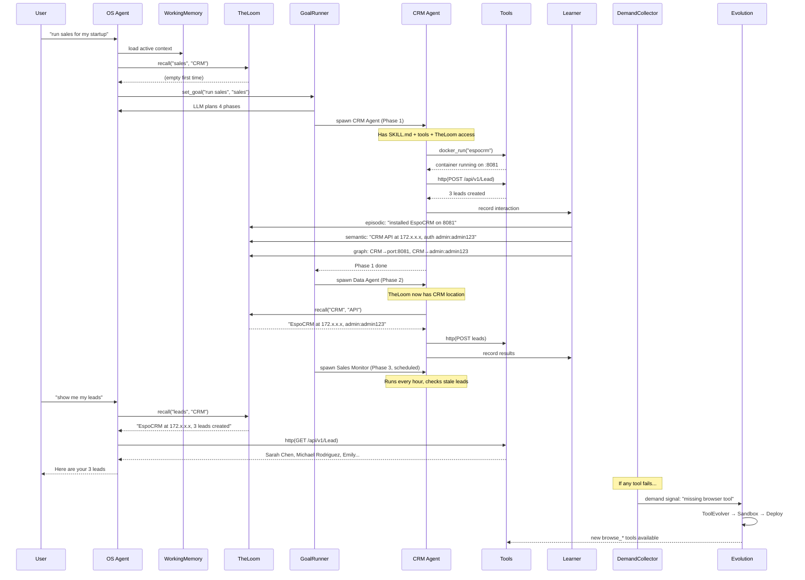

# OpenSculpt — System Architecture

## Core Model

OpenSculpt has 5 concepts. Everything else is implementation detail.

### 1. OS Agent (the master)

The OS Agent is the brain. It NEVER does work itself. It decides what needs doing, spawns the right sub-agent, gives it the right skills, and monitors progress.

```
User: "run sales for my company"
  ↓
OS Agent thinks: "This needs a CRM, data, and ongoing monitoring"
  ↓
Spawns 3 sub-agents, each with specific skills and tools
```

### 2. Sub-Agents (the workers)

A sub-agent gets a task, uses tools, finishes, reports back. Some are one-shot (install CRM). Some are persistent (check leads every hour).

```
OS Agent (master)
  ├── spawns Sub-Agent "install CRM"         (one-shot)
  │     ├── uses tools: docker_run, http
  │     ├── learns: CRM API, auth, ports
  │     └── saves Skill: sales_crm.md
  │
  ├── spawns Sub-Agent "create leads"        (one-shot)
  │     ├── loads Skill: sales_crm.md
  │     ├── uses tools: http
  │     └── updates Skill: lead field names
  │
  └── spawns Sub-Agent "sales monitor"       (persistent, hourly)
        ├── loads Skill: sales_crm.md
        ├── uses tools: http
        ├── writes to TheLoom: "2 stale leads"
        └── sends alert via Channel
```

### 3. Skills (the knowledge)

A Skill is what a sub-agent learned, saved as a document. When a sub-agent figures out that EspoCRM's lead endpoint is `/api/v1/Lead` with Basic auth — that becomes a Skill. The next sub-agent doesn't re-discover it.

Skills flow upward: Sub-agent learns → saves Skill → next sub-agent inherits → learns more → saves updated Skill → system gets smarter.

Without skills: every sub-agent re-discovers the API. 25 turns, 200K tokens.
With skills: sub-agent reads the skill doc. 3 turns, 5K tokens.

### 4. Memory (TheLoom — what sub-agents learned, stored permanently)

When a sub-agent installs EspoCRM and discovers the API is at `172.x.x.x/api/v1/` with auth `admin:admin123` — that's a **fact**. It goes into TheLoom.

When the sales monitor runs 100 times and finds "leads from Web source convert 3x better than Cold Call" — that's a **pattern**. The Consolidator extracts it.

When the KnowledgeGraph records `Lead Sarah Chen → Company TechFlow → Deal $25K → Stage Proposal` — that's a **relationship**.

Memory is the sub-agents' shared brain. Every sub-agent reads it before starting. Every sub-agent writes to it after finishing.

```
Sub-Agent does work → Learner writes to TheLoom
                            ↓
                     Episodic: what happened
                     Semantic: facts learned
                     Graph: relationships discovered
                     Skill: how to use this system
                            ↓
                     Next Sub-Agent reads TheLoom → starts smart
```

### 5. Evolution (when the OS can't do something, it builds the capability)

Day 1: Sub-agent uses `shell("docker run ...")` because there's no docker tool. DemandCollector watches: "sub-agent used shell for docker 8 times." That's a demand signal.

Evolution cycle picks it up → activates native docker tool → next sub-agent uses `docker_run` instead of shell.

Week 3: Sub-agent classifying tickets takes 10 LLM turns every time. DemandCollector: "ticket classification is expensive." Evolution: Arxiv finds a paper → CodeGen builds a classifier → Sandbox tests it → deployed as `classify_ticket()` tool. Next time: 1 tool call instead of 10 turns.

```
Sub-Agent struggles or fails
       ↓
DemandCollector records the gap
       ↓
Evolution cycle (priority pipeline):
  P0: SourcePatcher — self-healing code patches with rollback
  P0.5: DemandSolver — LLM reasons: create_tool, patch_source, skill_doc, tell_user
  P0.7: EvolutionAgent — senior engineer for impasse demands (every 3rd cycle)
  P1: ToolEvolver — generate + sandbox + deploy tools from demands
  P2: General tool evolution (only if demands exist)
       ↓
Scoring engine updates artifact scores (efficacy, adoption, stability)
       ↓
Fleet sync shares evolved knowledge + scores across nodes
       ↓
Next Sub-Agent has new capability
       ↓
OS is now better than yesterday
```

**Memory makes sub-agents remember. Evolution makes the OS grow new abilities. Federation makes every instance smarter.**

Memory is fast (every interaction). Evolution is slow (hours/days). Federation is continuous (gossip sync every 60s). Together they make the self-sculpting OS — every failure is a chisel strike (something breaks), every fix reveals a better shape (OS evolves the fix, shares it across the fleet). Claude Code is the chisel. The OS is the stone.

---

## Complete Component Wiring



## Data Flow: "run sales for my startup"



## Component Status

```mermaid
graph LR
    subgraph WORKING[Working]
        W1[OS Agent]
        W2[Tools: shell, http, python, read/write, docker, browser]
        W3[EventBus]
        W4[AuditTrail]
        W5[Dashboard]
        W6[CLI: ask, seed, contribute, curator, evolve, ...]
        W7[Evolution: DemandSolver, ToolEvolver, SourcePatcher, EvolutionAgent]
        W8[Daemons: researcher, monitor, scheduler, DomainDaemon]
        W9[Desktop App]
        W10[TheLoom - reads AND writes from OS agent + DomainDaemons]
        W11[Learner - records interactions + tool calls]
        W12[GoalRunner - DAG execution, spawns DomainDaemons]
        W13[WorkingMemory - loads context per command]
        W14[KnowledgeGraph - links systems, ports, endpoints]
        W15[DemandCollector - collects capability gaps]
        W16[Consolidator - compresses old memories hourly]
        W17[SessionCompactor - compresses long conversations]
        W18[Intent Classifier - enriches OS agent context]
        W19[GarbageCollector - internal + AWS resource reclamation]
        W20[Scoring Engine - efficacy+adoption+stability per artifact]
        W21[Fleet Curator - aggregates fleet data, packages releases]
        W22[P2P Gossip Sync - shares evolved code+skills+scores]
        W23[Seed/Contribute - bootstrap from releases, export knowledge]
    end

    subgraph PARTIAL[Partially Wired]
        P1[AgentRegistry - shows agents, no lifecycle]
        P2[DomainDaemon persistence - lost on restart]
        P3[MetaEvolver - disabled after 0 output in 32 cycles, kept for metrics]
        P4[ConstraintStore - REPLACED by TaggedConstraintStore]
    end

    subgraph GHOST[Code Exists, Never Called]
        G1[MemoryNotes]
        G2[Proactive Suggestions]
        G3[Personas]
        G4[Coordination/Team]
        G5[Ambient Watcher]
        G6[Channels: Slack, email]
        G7[Policy Engine rules]
        G8[TaskPlanner]
    end

    classDef working fill:#1a4d2e,stroke:#22c55e,color:#fff
    classDef partial fill:#5c3d1a,stroke:#f59e0b,color:#fff
    classDef ghost fill:#5c1a1a,stroke:#ef4444,color:#fff

    class W1,W2,W3,W4,W5,W6,W7,W8,W9,W10,W11,W12,W13,W14,W15,W16,W17,W18,W19,W20,W21,W22,W23 working
    class P1,P2,P3,P4 partial
    class G1,G2,G3,G4,G5,G6,G7,G8 ghost
```



## 150 Files, 34,566 Lines — What Each Subsystem Does

| Folder | Files | Purpose | Status |
|--------|-------|---------|--------|
| `agos/kernel/` | 3 | AgentRuntime, Agent, StateMachine | Partial — agents don't use runtime |
| `agos/knowledge/` | 9 | TheLoom: episodic, semantic, graph, learner, consolidator, notes, working memory, **TaggedStore** | **Working** — OS agent reads+writes, Learner records, TaggedStore for constraints+resolutions |
| `agos/evolution/` | 25 | DemandSolver, ToolEvolver, SourcePatcher, EvolutionAgent, scoring, curator, curator_loop, sync, codegen, sandbox, meta, demands | Demand-driven loop + federated scoring + fleet curator + P2P sync |
| `agos/tools/` | 6 | Tool registry, builtins, docker, browser, extended | Works — docker+browser activated at boot |
| `agos/daemons/` | 8 | Researcher, monitor, digest, scheduler, goal_runner, **DomainDaemon** | Works — DomainDaemon spawned by GoalRunner with LLM+TheLoom |
| `agos/cli/` | 6 | `sculpt` CLI commands | Works |
| `agos/dashboard/` | 1 | FastAPI + HTML dashboard | Works |
| `agos/events/` | 2 | EventBus + tracing | Works — backbone |
| `agos/policy/` | 3 | Audit trail, policy engine, schema | Audit works, policy unused |
| `agos/processes/` | 3 | ProcessManager, AgentRegistry, WorkloadDiscovery | Registry works, PM unused |
| `agos/a2a/` | 3 | Agent-to-Agent protocol | Complete, no peers |
| `agos/mcp/` | 3 | Model Context Protocol | Complete, no servers |
| `agos/channels/` | 3 | Notification channels (Slack, email, etc.) | Not connected |
| `agos/intent/` | 3 | Intent classification, personas, proactive | Intent wired to OS agent; personas/proactive unused |
| `agos/triggers/` | 4 | File watch, schedule, webhook triggers | Partially used |
| `agos/coordination/` | 3 | Team coordination, workspace | Never used |
| `agos/ambient/` | 1 | Ambient watcher | Never used |
| `agos/sandbox/` | 3 | Sandbox execution for evolved code | Works for evolution |
| `agos/llm/` | 4 | LLM providers (Anthropic, base, providers) | Works |
| `agos/desktop/` | 3 | PyWebView desktop app | Works |

## Scalable Knowledge Architecture (Tagged Stores)

Constraints and resolutions are stored in **environment-tagged directories**, not flat files.
This scales to 10,000+ entries because each node only reads files matching its environment.

```
.opensculpt/constraints/          .opensculpt/resolutions/
├── _index.md  (1-line/entry)     ├── _index.md  (symptom→fix)
├── general.md                    ├── deployment.md
├── macos.md                      ├── networking.md
├── windows.md                    ├── packages.md
├── linux-debian.md               ├── docker.md
├── docker.md                     ├── auth.md
├── no-docker.md                  ├── database.md
├── corporate-proxy.md            └── general.md
├── low-memory.md
├── arm64.md
└── container.md
```

### How It Works

1. **EnvironmentProbe** detects OS, Docker, arch, memory, proxy → generates **tags** (e.g. `["linux", "linux-debian", "docker", "general"]`)
2. **TaggedConstraintStore.load()** reads ONLY files matching those tags (~60-120 entries, ~3-5KB)
3. **TaggedConstraintStore.add()** classifies by keyword → routes to correct file → fingerprint dedup
4. **TaggedResolutionStore.lookup()** normalizes symptom to fingerprint → scans index → O(1) match
5. **Federation sync** sends only tag files matching the REMOTE peer's `environment_tags`

### Scale Profile

| Users | Total constraints | Loaded per request | Why it works |
|-------|------------------|--------------------|--------------|
| 10 | ~100 | ~30 (3 tag files) | Small corpus, all useful |
| 100 | ~500 | ~60 (4 tag files) | Environment-filtered, deduped |
| 1,000 | ~2,000 | ~80 (5 tag files) | Tags cap growth per file |
| 10,000 | ~5,000 | ~100 (5 tag files) | Environments are finite |

### Key Files

- `agos/knowledge/tagged_store.py` — TaggedConstraintStore, TaggedResolutionStore, fingerprint(), classify_tag(), environment_tags()
- Boot migration: `serve.py` auto-migrates legacy flat `.md` files on first start after upgrade

## Wiring Rules — When X Happens, Call Y

Every component has a trigger. This table defines when each system must be called:

| Trigger | System to Call | What It Does |
|---------|---------------|-------------|
| OS agent starts handling a command | WorkingMemory.load() | Loads active task context |
| OS agent starts handling a command | TaggedConstraintStore.load() | Injects environment-filtered constraints into prompt |
| OS agent starts handling a command | TheLoom.recall(command) | Injects relevant knowledge into prompt |
| OS agent finishes a command | Learner.record_interaction() | Writes to episodic + semantic + graph |
| OS agent tool call completes | Learner.record_tool_call() | Records tool usage to episodic |
| docker_run succeeds | TheLoom.remember() as fact | "Installed X on port Y" |
| http call succeeds with 200 | TheLoom.remember() as fact | "API endpoint works: URL" |
| Conversation history > 20 messages | SessionCompactor.compact() | Summarizes old messages |
| User gives high-level goal | GoalRunner.create_goal() | LLM plans phases, persists to disk |
| GoalRunner tick (every 5 min) | GoalRunner._advance_goal() | Executes next pending phase |
| Phase executes | spawn_agent as persistent Hand | Visible in dashboard, has SKILL.md |
| Phase completes successfully | GoalRunner._save_skill_from_result() | Creates SKILL.md from learned APIs |
| Phase needs recurring work | GoalRunner._create_domain_hand() | Spawns DomainDaemon (LLM+TheLoom+tools, fast_check gates smart_tick) |
| DomainDaemon tick (configurable interval) | DomainDaemon._fast_check() | Cheap gate: HTTP/API/Docker check — skips LLM if nothing needs attention |
| DomainDaemon fast_check returns needs_attention=True | DomainDaemon._smart_tick() | LLM reasons with skill docs + TheLoom context (max 5 turns, 10K tokens) |
| DomainDaemon smart_tick completes | TheLoom.remember() | Writes findings tagged `daemon:{name}` — accumulates domain knowledge |
| Sub-agent spawned | AgentRegistry.register_live_agent() | Appears in Agents tab |
| Sub-agent completes | AgentRegistry.mark_agent_completed() | Status updates in dashboard |
| Sub-agent completes | Learner.record_interaction() | Results saved to TheLoom |
| Shell command uses docker/kubectl/etc | os.capability_gap event | DemandCollector creates signal |
| Tool fails | os.tool_result with ok=False | DemandCollector tracks failure count |
| Command uses >50K tokens | os.complete event | DemandCollector flags expensive task |
| Demand signals accumulate | Evolution cycle consumes them | ToolEvolver generates/activates tools |
| Evolution finds builtin exists | evolution.builtin_activated event | OS agent registers dormant tools |
| Every 24 hours | Consolidator.run() | Compresses old episodic into semantic |
| Agent crash | agent.error event | DemandCollector + AuditTrail |
| GoalRunner phase fails then succeeds | TaggedConstraintStore.add() | Learns environment constraint, routed to correct tag file |
| GoalRunner discovers fix pattern | TaggedResolutionStore.add() | Saves fingerprinted resolution for instant future lookup |
| DemandSolver encounters demand | TaggedResolutionStore.lookup() | Fingerprint-based fast match — skips LLM if resolution exists |
| DemandSolver resolves demand | TaggedResolutionStore.add() | Records new resolution for future use |
| Boot (first after upgrade) | migrate_flat_file() | One-time migration of legacy flat .md → tagged directories |
| Fleet sync enabled | sync_loop() | P2P gossip shares evolved code, skills, scores, tagged constraints, tagged resolutions |
| Sync manifest requested | build_local_manifest() | Includes efficacy data + environment_tags (so peers send only relevant knowledge) |
| Sync payload built | build_sync_payload() | Filters constraint files by remote peer's environment_tags |
| Evolved file already exists on sync | Score-based conflict resolution | Higher composite score wins (not first-write-wins) |
| End of evolution cycle | LocalScorer.update() | Updates artifact efficacy/stability scores from demand resolution status |
| Artifact scores updated | update_archive_scores() | Pushes composite scores into DesignArchive.current_fitness for ALMA selection |
| Artifact scores updated | evolution_state.save_json("artifact_scores") | Persisted for sync + curator consumption |
| `sculpt curator --release` | curator.generate_fleet_report() + create_release() | Reads .opensculpt-fleet/*, scores, packages top artifacts into releases/v{N}/ |
| `sculpt seed` | curator.apply_release() | Merges release tools, skills, constraints, resolutions into local workspace |
| `sculpt contribute` | curator.export_contribution() | Exports anonymized local knowledge to .opensculpt/contributions/ |
| GC tick (every 5 min) | GC._gc_internal() | Reaps orphaned resources, stale goals, dead agents, temp files, expired knowledge |
| GC tick (every 5 min) | GC._gc_aws() | Scans AWS regions for OpenSculpt-tagged resources whose goal is dead, terminates past grace period |
| Goal marked stale/failed/complete | GC detects orphaned resources | AWS resources tagged with dead goal_id become termination candidates |
| GC terminates AWS resource | gc.aws_terminated event | Logged to EventBus + AuditTrail |

**CRITICAL: This table is the contract. Every row must be verified with a test. If a row doesn't work, the system is broken.**
